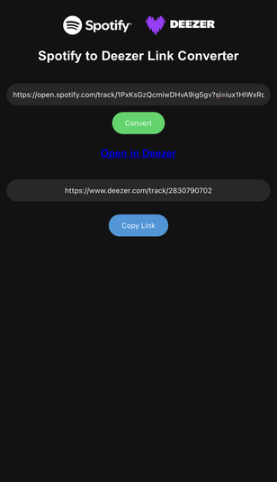

# Spotify to Deezer Link Converter

This project is a simple web application that converts Spotify links to their corresponding Deezer links. It allows users to easily find and share content across these two popular music streaming platforms.



## Features

- Convert Spotify links to Deezer links for:
  - Tracks
  - Artists
  - Albums
  - Playlists
- Simple and intuitive user interface
- Mobile-friendly design
- Copy converted links to clipboard with one click

## How It Works

1. The user enters a Spotify link into the input field.
2. The application fetches metadata about the content from Spotify's oEmbed API.
3. Using the retrieved information, it searches for the corresponding content on Deezer using their API.
4. If a match is found, the application displays the Deezer link and provides a copy button for easy sharing.

## Technologies Used

- HTML5
- CSS3
- JavaScript (ES6+)
- Spotify oEmbed API
- Deezer API

## Setup and Usage

1. Clone this repository to your local machine:

   ```
   git clone https://github.com/yourusername/spotify-to-deezer-converter.git
   ```

2. Navigate to the project directory:

   ```
   cd spotify-to-deezer-converter
   ```

3. Open the `index.html` file in your web browser.

4. Enter a Spotify link (track, artist, album, or playlist) and click "Convert".

5. If a match is found on Deezer, you'll see the converted link. Click "Copy Link" to copy it to your clipboard.

## Important Notes

- This project uses a CORS proxy (https://cors-anywhere.herokuapp.com/) for development purposes. For production use, you should implement your own backend to handle API requests securely.
- You may need to request temporary access to the demo server at https://cors-anywhere.herokuapp.com/corsdemo before using the converter.
- Always respect the terms of service for both Spotify and Deezer APIs when using this tool.

## Future Improvements

- Implement a backend server to handle API requests securely
- Add support for converting multiple links at once
- Improve error handling and user feedback
- Implement user authentication to increase API rate limits

## Contributing

Contributions are welcome! Please feel free to submit a Pull Request.

## License

This project is open source and available under the [MIT License](LICENSE).

## Disclaimer

This project is not affiliated with, maintained, authorized, endorsed, or sponsored by Spotify or Deezer.
